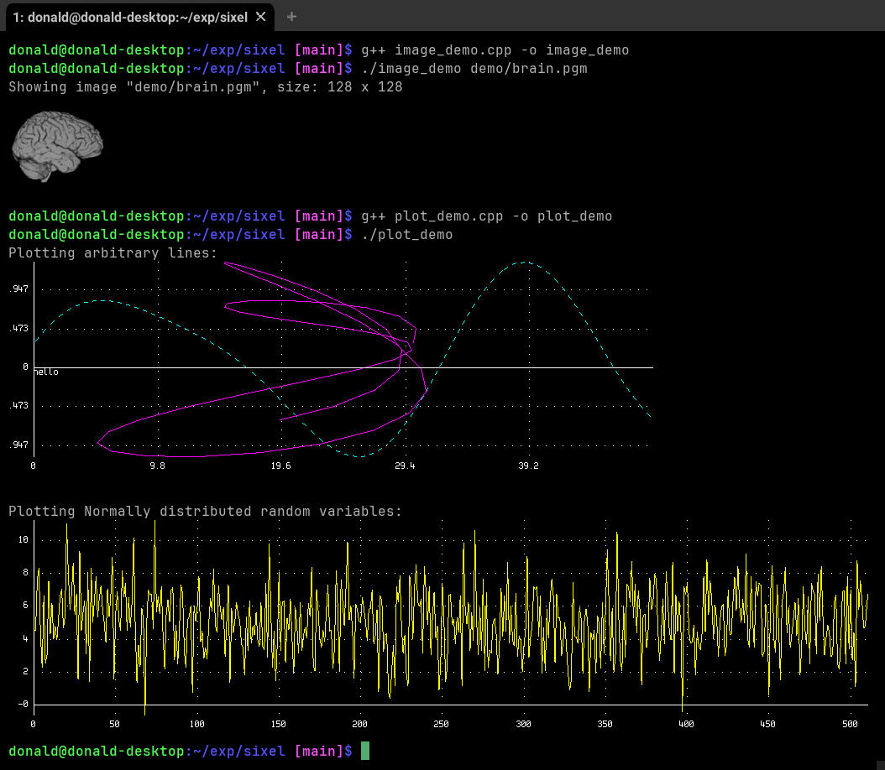

# sixel

A simple header-only function to render images to terminal using sixels.

## Requirements

This should compile using any standard-compliant C++11 compiler, using a
command such as:

```
g++ main.cpp -o main
```

To work, this requires a sixel-capable terminal, such as:
- on Linux: xterm, mlterm
- on macOS: iTerm2
- on Windows: minTTY

## Demonstration




## Contents

- For the sixel render only, you only need to include the `sixel.h` header into
  your project
- A simple image class is provided in the `image.h` header
- A simple ascii PGM reader is provided in the `pgm.h` header


