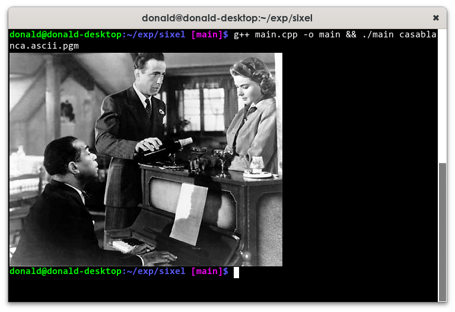

# sixel

A simple header-only function to render images to terminal using sixels.

To work, this requires a sixel-capable terminal, such as:
- on Linux: xterm, mlterm
- on macOS: iTerm2
- on Windows: minTTY

## Demonstration

